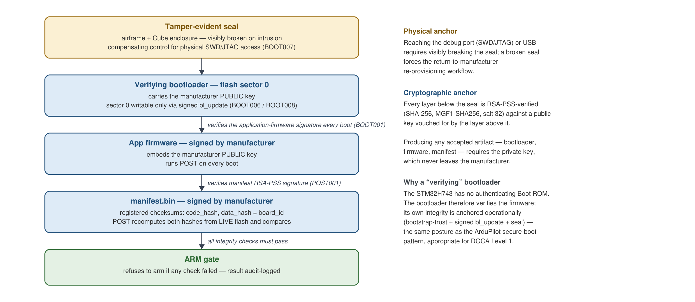

# inoflyTools — UAS Firmware Security Compliance Framework

Host-side tooling, test suite, and security documentation for a firmware
secure-boot and integrity chain built on **PX4** for the **CubePilot
CubeOrange+** (STM32H757ZI) flight controller.

The work was scoped against **Section 7.1 of the DGCA Certification Scheme for
Unmanned Aircraft Systems (Level 1)** — India's airworthiness requirements for
firmware tamper avoidance, secure firmware update, protected flight parameters,
and signed operational logs. The role taken throughout is that of the
**firmware manufacturer**: we hold the signing key, generate the registered
checksums, and produce the evidence package. The Certification Body is a
separate party.

### Status — read this first

| | |
|---|---|
| **Certification** | **Not certified.** This is certification-*ready*: implemented, bench-validated, with the evaluator-facing evidence package built. No evaluation has been completed with a certification body or lab. |
| **Hardware validation** | Real silicon, **bench only** — no motors, no propellers, no telemetry radio, props off throughout. Arming was exercised as *gate logic*, not flight. **No flight testing was performed.** |
| **Signing key** | The tracked `pki/manufacturer/public/manufacturer_public.pem` is a **test key**. No production key material is in this repository or its history. |
| **Timeline** | March 2026 – August 2026 · 92 commits · single author |

---

## Start here

**If you are evaluating the security and certification work:**

| Document | What it is |
|---|---|
| [Docs/THREAT_MODEL.md](Docs/THREAT_MODEL.md) | Security problem definition — 15 enumerated threats (T1–T15), risk summary, assumptions and operational boundaries, and an attack tree analysing every known bypass path against the boot chain |
| [Docs/audit/COMPLIANCE_7.1_MAPPING.md](Docs/audit/COMPLIANCE_7.1_MAPPING.md) | Clause-by-clause conformance mapping from the scheme's requirement tree to implementation and test evidence |
| [Docs/ARCHITECTURE.md](Docs/ARCHITECTURE.md) | The canonical architecture reference, including **25 decision records** with rationale. Retired decisions are preserved struck-through alongside what replaced them, so the reasoning is auditable rather than just the outcome |
| [Docs/audit/](Docs/audit/) | The evaluator-facing package — conformance statement, test runbook, build identity, key provisioning procedure, flashing SOP, demonstration script, glossary |

**If you are reading the engineering:**

| Document | What it is |
|---|---|
| [SECURITY_PLAN.md](SECURITY_PLAN.md) | Requirement-by-requirement detail across 22 requirement IDs (`ROT001`, `CHK001`, `POST001–004`, `BOOT001–008`, `UPD001`, `PAR001`, `LOG001`, `PAIR001`, …) |
| [Docs/HARDWARE_ACCEPTANCE.md](Docs/HARDWARE_ACCEPTANCE.md) | The H0–H17 hardware acceptance matrix as actually run on a CubeOrange+, including failures and their root causes |
| [Docs/BOOTLOADER_BRINGUP.md](Docs/BOOTLOADER_BRINGUP.md) | The B1–B10 bootloader bring-up matrix, including power-loss-during-update testing |
| [Docs/SITL_ACCEPTANCE.md](Docs/SITL_ACCEPTANCE.md) | The simulation gate that had to pass before any hardware was flashed |

---

## What was built

Each layer in the chain is cryptographically verified by the layer above it.
All signatures use a single **RSA-2048** keypair with **RSA-PSS / SHA-256**;
the private half never leaves an offline environment, and only the public half
is resident on the device — so a fully compromised aircraft holds nothing
capable of *producing* a valid signature.



| Mechanism | What it does |
|---|---|
| **Verifying bootloader** (`BOOT001`) | Checks the application firmware's RSA-PSS signature on every boot against a public key embedded in the bootloader binary. Refuses to launch a modified or foreign-signed image |
| **Power-on integrity self-test** (`POST001–004`) | Recomputes SHA-256 over the code and data regions **separately** from live flash and compares against a signed manifest. Mismatch blocks arming and is logged. Also binds the firmware to the specific board ID |
| **Signed firmware update** (`UPD001`) | Manifest verification, anti-rollback via a signed timestamp, hash-binding of the staged image, re-verification immediately before erase, torn-write-safe application with unattended power-loss retry, and quarantine of rejected images |
| **Signed bootloader update** (`BOOT008`) | The bootloader install path itself verifies a manufacturer signature before erasing sector 0, fail-closed |
| **Protected flight parameters** (`PAR001`) | Compliance-critical parameters are compiled into a dedicated flash section covered by the data hash, in two kinds: *capped* (operator may tune up to a certified ceiling, RAM-only) and *locked* (only the registered value accepted). Violations are audit-logged |
| **Signed audit log** (`LOG001`) | The flight module seals its own security log; the manufacturer verifies it offline with the private key |
| **Ground-station authentication** (`PAIR001`) | MAVLink v2 message signing, keyed from a provisioning passphrase so a ground station without it cannot command the aircraft |
| **Physical compensating control** (`BOOT007`) | Tamper-evident sealing of the enclosure and airframe, with UID and seal-serial recording at manufacture and an RMA quarantine workflow — the documented substitute for silicon readout protection, which the shipped carrier board made infeasible |

### Scope and non-goals

Stated plainly, because an honest boundary is part of the deliverable:

- **No link encryption.** MAVLink signing provides authentication, not
  confidentiality. Flash encryption was deliberately scoped out — DGCA Level 1
  requires integrity and authenticity, not confidentiality — and the decision
  is recorded rather than implied.
- **Physical attacker is out of scope**, mitigated by tamper evidence rather
  than prevented. The reasoning, and what it costs, is in the threat model.
- **One known residual is documented and unresolved:** MAVLink signing fails
  *open* if the key file is missing or zeroed, and locking the policy parameter
  does not close it. It is written down rather than quietly carried.

---

## Repository layout

```
tools/           28 Python tools (~7,900 LOC) — key generation, checksum
                 generation, firmware/bootloader/TOC signing, release
                 pipeline, bundler, device provisioning, offline log
                 verification, compliance reporting, document generation
tests/
  compliance/    424 tests, each named with the requirement ID it covers
  integration/   SITL end-to-end tests (requires WSL2 + PX4 SITL)
Docs/            Architecture, threat model, acceptance matrices, runbooks
  audit/         Evaluator-facing evidence package + architecture diagrams
pki/             Public key material only. Private keys are gitignored and
                 have never been committed
firmware/        The embedded public-key header consumed by the PX4 build
```

## Running the test suite

Python 3.13. No hardware and no network access required.

```bash
python -m venv .venv
.venv/bin/python -m pip install -r requirements.txt      # Windows: .venv\Scripts\python
.venv/bin/python -m pytest tests/compliance              # 424 tests, ~15s
```

**424 pass** with a PX4 checkout present. Roughly 26 of them assert directly
against the PX4 firmware source — that the `.compliance_params` table holds the
registered values, that the POST gate is wired as documented — and these skip
cleanly with a stated reason when no checkout is available. The remainder
(signing, checksums, manifests, bundling, provisioning, offline log
verification) are pure host-side and need nothing but Python.

Every test name carries the requirement ID it exercises
(`test_POST001_...`, `test_BOOT008_...`), so a failing test points directly at
the compliance clause it breaks. Integration tests additionally require a
PX4 SITL build.

```bash
python tools/generate_compliance_report.py # auditor-facing report
python tools/pipeline.py --help            # full release pipeline
```

## Related repositories

The firmware and ground-station changes live in forks, not here:

| Repo | Contents |
|---|---|
| [inoflyPilot](https://github.com/rahulkalsariya30/inoflyPilot) | PX4 fork — the `secure_boot` module (~3,000 LOC C++) and bootloader additions (~1,400 LOC C, including a bare-metal polled SDMMC driver for verify-before-erase updates). Based on PX4 `v1.17.0-alpha1` |
| [inoflyGCU](https://github.com/rahulkalsariya30/inoflyGCU) | QGroundControl fork — security plugin (~4,000 LOC C++/QML): security status panel, signature-verified firmware update flow, audit-log download, pairing |

---

## Notes

**On the test key.** `manufacturer_public.pem` is a development key used so
the test suite and SITL flow are reproducible by anyone cloning this repo. A
production deployment replaces it per
[Docs/audit/PRODUCTION_KEY_PROVISIONING.md](Docs/audit/PRODUCTION_KEY_PROVISIONING.md).
Never treat it as trusted.

**Licensing.** No license is granted. This repository is published for review
and discussion, not reuse. The PX4 and QGroundControl forks carry their own
upstream licenses.

**Third-party reference material** consulted during the work (vendor
compliance documents obtained under confidence) is deliberately absent from
this repository and its history.
